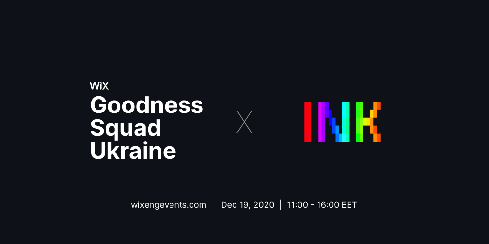

<h1 align="center">
	<br>
	<br>
	
	<br>
	<br>
	<br>
</h1>

Welcome to [Goodness Squad](https://www.wixengevents.com/)!

If you are reading this readme, chances are you've decided to contribute to [Ink](https://github.com/vadimdemedes/ink). It's good to have you here! Let's get started.

# Getting Started

Make sure you have Git, Node.js (at least v12.x) and npm installed.

- [Git installation guide](https://git-scm.com/book/en/v2/Getting-Started-Installing-Git)
- [Node.js and npm installation guide](https://nodejs.org/en/download/package-manager/)

If you're on macOS or Linux, you're good to go.

If you're on Windows, you should also install a modern terminal. I haven't tested these myself, but either should work fine:

- [New Windows Terminal](https://github.com/microsoft/terminal)
- [Terminus](https://eugeny.github.io/terminus/)
- [Hyper](https://hyper.is/)
- [Cygwin](https://www.cygwin.com/)

# Projects

You can see the list of ideas in the [Goodness Squad](https://github.com/vadimdemedes/goodness-squad/projects/1) project in this repository.
Each issue is assigned a label, which signals its difficulty level - starter, medium or advanced.
Issues have brief descriptions, hints and relevant links for you to look at before working on it.

If you have questions, please ask right away. Normally I'd recommend spending some time on digging stuff up yourself, but we've got only 5 hours, so don't hesitate.

If you've decided to work on a particular issue, make sure to reply inside the issue, so that other people don't end up working on the same thing as you.

There are 3 types of projects:

- [Direct contributions to Ink](#direct-contributions-to-ink)
- [Standalone components](#standalone-components)
- [CLIs](#clis)

## Direct contributions to Ink

This involves contributing to Ink itself by modifying its source code.

1. Fork [vadimdemedes/ink](https://github.com/vadimdemedes/ink) repository
2. Clone your fork
4. Install npm dependencies
3. Create a new branch
4. Make changes
5. Push to your fork
6. Create a pull request on Ink's repository
7. Wait for a review, address feedback and PR will be merged

Make sure to read the readme first.

Useful commands:

- `npm run build` - Compiles source code
- `npm test` - Runs tests

Source code lives in `src` directory. Essential files inside are:

- [render.ts](https://github.com/vadimdemedes/ink/blob/master/src/render.ts) - renders an Ink app, similar to `render` from `react-dom`
- [ink.tsx](https://github.com/vadimdemedes/ink/blob/master/src/ink.tsx) - instance of Ink app that manages everything, from rendering to exiting the app
- [log-update.ts](https://github.com/vadimdemedes/ink/blob/master/src/log-update.ts) - erases last output and renders new text output
- [reconciler.ts](https://github.com/vadimdemedes/ink/blob/master/src/reconciler.ts) - custom React reconciler
- [dom.ts](https://github.com/vadimdemedes/ink/blob/master/src/dom.ts) - implementation of a simple DOM
- [styles.ts](https://github.com/vadimdemedes/ink/blob/master/src/styles.ts) - applies CSS styles to Yoga nodes
- [output.ts](https://github.com/vadimdemedes/ink/blob/master/src/output.ts) - generates a text output of all components given their coordinates and dimensions

## Standalone components

If issue description recommends creating a standalone component, that means it's better to publish it as a separate package, outside of Ink.
I recommend this in cases where mentioned functionality isn't essential to all Ink users, so it shouldn't be in the core source code.

Copy the source code of [vadimdemedes/ink-spinner](https://github.com/vadimdemedes/ink-spinner) repository and replace the readme and code with yours.
It has pretty much everything to get started with your own component.

When you're done, ping me and we'll go through it together and then publish!

## CLIs

If you want to create your own CLI using Ink, there's no simpler way to start than `create-ink-app`.
One command and you're good to go:

```bash
$ npx create-ink-app
```
